# 深度学习简史  

## 1958年: 感知器的兴起

1958年，Frank Rosenblatt 提出了感知机（**注**：有的资料认为是 1957 年提出的，本文以 Frank Rosenblatt 的文章《The Perceptron: A Probabilistic Model for Information Storage and Organization in the Brain》发表时间为准），这是一种非常简单的机器，后来成为今天智能机的核心和起源。感知机是一个非常简单的二元分类器，它可以判断输入的图像是否属于给定的类别。为了实现这一点，它使用单位阶跃函数作为激活函数。

> **单位阶跃函数**（step function），又称为**赫维赛德阶跃函数**（Heaviside step function），定义为：
>
> $$H(x)=\begin{cases}1,x\gt0\\0,x\le0\end{cases}$$

对于感知机而言，如果输入值大于 $$0$$ ，则输出值为 $$1$$ ；反之，如果输入值小于 $$0$$ ，则输出值为 $$0$$ 。这是感知器的算法。

​    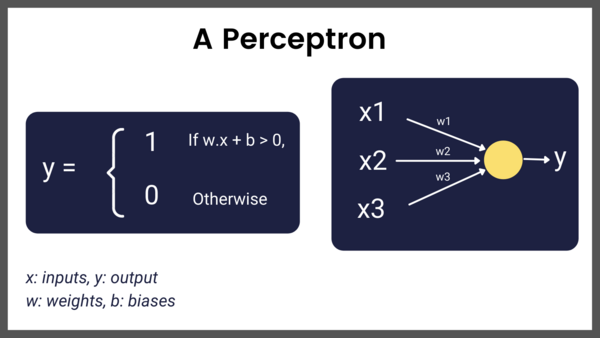 

感知器

Frank 并不仅仅把感知机局视为一种算法，他还造了一台真正的实现算法的机器，这台硬件设备命名为 Mark I。这是一个纯粹的电子设备，它有 400 个广电探测器组成，用电位器实现权重，反向传播中的权重更新则由电机完成。

​    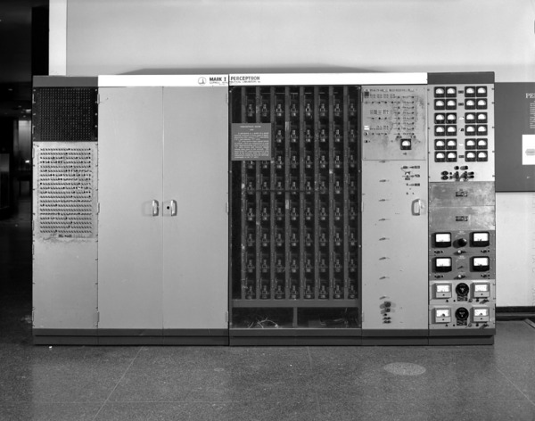 

Mark I 感知器，图片来自美国国家历史博物馆

如同现如今在新闻媒体中会看到很多关于神经网络的内容一样，当时感知机也是热门话题。《纽约时报》曾报道，“海军希望电子计算机能够孕育出能走路、会说话、能看会写、还能自我复制并有自我意识东西”。甚至于直到今天，我们所制造的机器仍然在努力地学习行走、说话、看、写等等，而“意识”还存在争论。Mark I 的目标仅仅是识别图像，在当时，它只能识别两类图像。过了一段时间之后，人们才认识到，必须增加更多的层（感知机是一层的神经网络）才可以让网络具备学习复杂函数的能力。这样就产生了多层感知机（MLPs）。  

## 1982~1986年：循环神经网络（RNNs）

在多层感知机解决了图像识别问题之后几年，人们开始思考如何为序列数据建模，例如文本。循环神经网络是一种用于处理序列数据的神经网络，与之前的多层感知机（MLP ）为代表的前馈网络不同， 循环神经网络（RNNs） 有一个内部反馈回路，这有助于记忆每步的信息状态。

​    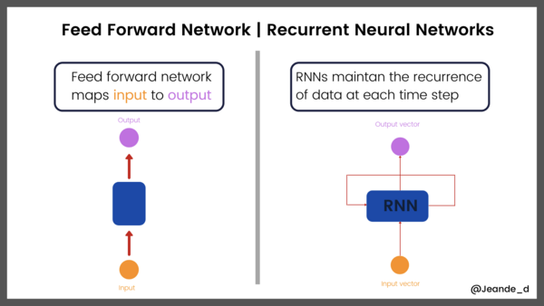

前馈网络 vs 循环神经网络

虽然 RNN 在 1982 到 1986 年之间已经被提出，但由于它存在短期记忆问题，无法处理较长的输入序列，因为一直没有受到关注，知道后来的长短期记忆网络出现。     

## 1998：LeNet-5: 第一个卷积神经网络  

LeNet-5 是最早的卷积神经网络框架之一。1998年，LeNet-5 用于文本识别。LeNet-5 由 3 部分组成：

- 2个卷积层，

- 2个子采样层或池化层，

- 3个全连接层。

卷积层中没有激活函数。

如前所言，LeNet-5 已投入商业应用。下面是 LeNet-5 的架构。

​    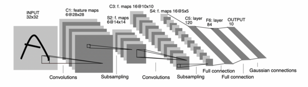   

LeNet-5 在当时确实很有影响力，然而，直到 20 年后它才引起关注！不仅仅是它，整个卷积网络也是如此。LeNet-5 的发展离不开早期的研究成果，如：最早的《卷积神经网络》（Fukushima），《反向传播》（Hinton 等人发表于 1986 年）和《反向传播用于识别手写邮政编码》（LeCun 等人发表于 1989 年）。

##  1998: 长短期记忆（LSTM）

由于梯度不稳定的问题，简单的循环神经网络（RNN）不能处理长序列，长短期记忆（LSTM）是可以用于处理长序列的 RNN 版本。LSTM 基本上是一个极端的 RNN ，它在设计上的独特之处在于引入了“门”，通过“门”控制每一步的信息。

- “输入门”识别输入序列；
- “遗忘门”去除输入序列中所有无关信息，并且将相关信息储存在长期记忆中；
- “更新门”改变神经元状态；
- “输出门”控制着发送到下一个循环的信息。

​    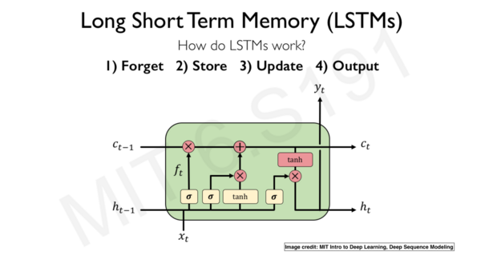 

LSTM架构。图片来自MIT 6.S191深度学习简介
  

LSTM 擅长处理序列的能力，使其常用于如文本分类、情感分析、语音识别、图像标题生成和机器翻译等有关序列类业务。LSTM 功能强大，但它的计算成本很高。为此，2014 年提出了门递归单元（GRU），以解决这一问题。与 LSTM 相比，GRU 的参数更少，而且同样有效。

## 2012：ImageNet 挑战，卷积神经网络的崛起

要谈论神经网络和深度学习的历史，几乎不可能避开 ImageNet 大规模视觉识别挑战（ImageNet Large Scale Visual Recognition Challenge，简称：ILSVRC）和 AlexNet。ILSVRC 的唯一目标是基于海量数据集对框架的图像分类和目标分类能力进行评估，许多新的、强大且有趣的框架因此而产生，见面简要地回顾一下这个过程。

- 挑战始于 2010 年，但 2012 年情况发生了变化，当时 AlexNet 以15.3% 的错误率在挑战中排名前五，这一错误率几乎是之前赢家的一半。AlexNet 包括 5 个卷积层，之后是最大池化层，最后是 3 个全连接层和一个 softmax 分类器层。AlexNet 认为深度卷积神经网络可以很好地处理视觉识别任务。但在那时，研究还没有更深入！
- 在接下来的几年里，卷积神经网络框架变得越来越大，效果越来越好。例如，拥有 19 层的 VGG 以 7.3% 的错误率在挑战中胜出。
- GoogLeNet 进一步改进，将错误降低到 6.7% 。
- 2015年，ResNet 将错误率降低到3.6%，并且表明：通过残留连接，可以训练更深层的网络（超过100层），这在当时是不可能的。人们日益发现：网络层次越深，效果越好。这就导致了其他新框架的问世，如 ResNeXt、Inception-ResNet、DenseNet、Xception，等等。参考资料 [2] 介绍了更多有关框架，敬请参阅。

​    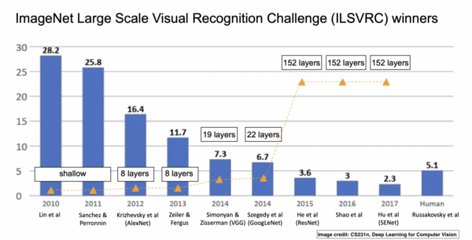 

ImageNet挑战。图片取自CS231n。

## 2014：深度生成网络 

生成网络用于从训练集数据中生成或合成新的数据样本，如图像和音乐。生成网络有很多类型，但最流行的是 GANs（生成对抗网络），它是由 Ian Goodfellow 在 2014 年创建的。GANs 主要由一个生成网络和一个判别网络组成。生成网络从潜在空间中随机取样作为输入，其输出结果尽量模仿训练集中的真实样本。判别网络的输入则为真实样本或生成网络的输出，其目的是将生成网络的输出从真实样本中尽可能分辨出来，而生成网络则要尽可能地欺骗判别网络。两个网络相互对抗，不断调整参数。每次训练，生成网络的输出越来越接近真实样本，最终目使判别网络无法判断生成网络的输出结果是否真实。

GANs 是深度学习社区中最热门的东西之一，该社区以生成不真实的图像和深度造假而闻名。在参考资料 [3] 中，可以了解关于 GAN 的更多知识。

​    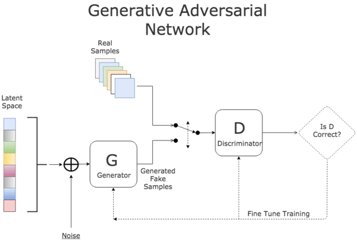 

 
生成对抗网络（GANs）

GANs 是生成模型的一种框架，其他流行的框架还有：变分自动编码器（VAE）、自动编码器和扩散模型。

## 2017：Transformers和Attention    

> 这里没有对 Transformer 和 Attention 进行翻译，部分原因在参考资料 [4] 中有所阐述，另外一个原因是才疏学浅，面对中文资料的不同翻译，不知如何选择，也不知孰对孰错。故，索性偷懒。

2017年，ImageNet 挑战结束了，新的卷积神经网络框架也问世了，从事计算机视觉的人们对当前的成果非常满意。以前，如果要进行图像分类、目标检测、图像分割等这些工作，是比较麻烦的，现在则大不相同，不仅操作容易，而且效果很好。人们可以用 GANs 生成逼真的图像。

似乎自然语言处理（NLP）落后于 CV 了，马上就要有大新闻了。一种纯粹基于 Attention 的新型神经网络框架，让 NLP 再次掀起波澜。几年后，Attention 机制在其他领域也攻城略地，最明显的就是 CV 。这个基于 Attention 的框架被称为 transformer 。参考资料 [5] 是一篇浅显易懂的介绍文章，请参考。下图说明了 Transformer 的基本结构。

​    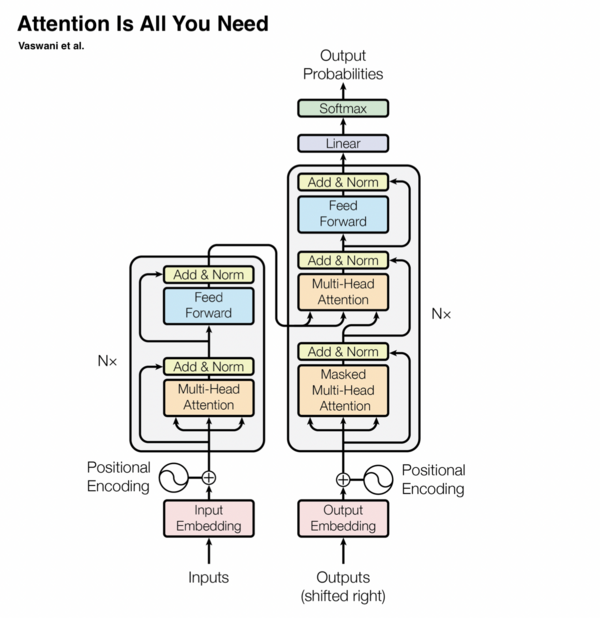 

Attention Is All You Need.
 

Transformer 已经彻底改变了 NLP，目前它正在彻底改变计算机视觉领域。在 NLP 中，Transformer已经被用于机器翻译、文本摘要、语音识别、文本补全、文档搜索等……你可以在《Attention is All You Need》$$^{[6]}$$这篇论文中了解关于 transformer 的更多信息。

## 2018 - 2020年代

自 2017 年以来，深度学习算法、应用和技术突飞猛进。为了清楚起见，之后的发展是按类别划分的。在每个类别中，我们都会回顾主要趋势和一些最重要的突破。

### 应用在图像上的 Transformers

自从 transformers 在 NLP 中大显身手之后，一些具有开创者就迫不及待地把 attention 应用在图像上了。几名谷歌的研究人员发表了一篇名为《An Image is Worth 16x16 Words: Transformers for Image Recognition at Scale》$$^{[7]}$$的论文，文章认为，一个普通的 transformer 稍加修改后，直接用于一个图像序列，就可以实现效果良好的分类。这些研究者将他们的框架命名为 Vision Transformer，简称 ViT。在很多 CV 研究中，都会看到 ViT，截至撰写本文时，它是 Cifar-10 上最先进的分类模型。ViT 的研究者其实不是第一个将 attention 用于视觉的识别工作的，论文《Attention Augmented Convolutional Networks》$$^{[8]}$$ 中的示例则更早，该论文试图将 self-attentions 与卷积相结合，从而解决卷积中的归纳偏差问题。另一个更早使用 attentions 的案例则出现在《Visual Transformers: Token-based Image Representation and Processing for Computer Vision》$$^{[9]}$$中，它将 transformers 用于词语过滤器或图像过滤器上。这两篇论文和许多没有在这里列出的论文共同推动了基础框架的发展，但没有超越 ViT ，所以参考资料 [7] 是业界重要文献之一，最伟大的创举在于 ViT 开发者直接用图像作为输入，不对 transformer 做太多改变。

​    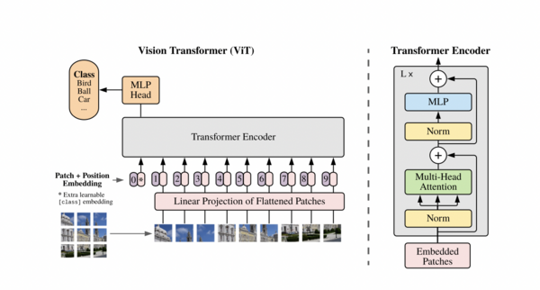 

ViT

上面的图片来自于参考资料 [7] 的论文，除了直接用图像作为输入外，另外两个强悍特征也引人注目：并行和可伸缩性。当然，ViT 也不是十全十美，比如早期在目标检测和图像分割上就表现不佳，直到后来引入了 Swin Transformer 之后才有所好转。Swin Transformer 的核心亮点在于：它在连续的 attention 层之间使用了滑动窗口。下图描述了Swin Transformer 和 ViT 在构建分层特征映射的方式上的区别。

​    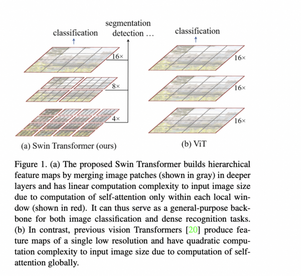 

Vison Transformers 是近期最令人兴奋的研究领域之一，更多内容可以在参考资料 [10] 中查阅，这方面的前沿研究还有 CrossViT$$^{[11]}$$、ConViT$$^{[12]}$$ 和 SepViT$$^{[13]}$$ 。

### V-L 模型  

V-L 模型是指同时涉及到视觉（vision）和语言（language）的模型，也称为多模型（multi-models），例如，根据文本内容生成与之匹配的图像、根据图像生成对其文本描述、根据图像内容生成相关答案等。transformer 在视觉和语言领域的成功很大程度上促成了单个统一网络的多模型。事实上，所有的视觉和语言任务都使用了预训练技术。在计算机视觉中，预训练通常是用大型数据集（例如 ImageNet）进行训练；在 NLP 中，一般对网络进行微调，通常是基于 BERT。要了解更多关于 V-L 任务的预训练，请阅读论文《A Survey of Vision-Language Pre-Trained Models》$$^{[14]}$$ 。另外一篇论文，对这方面的发展做了表好的概括，请查阅参考资料 [15] 的文章 《Trends in Integration of Vision and Language Research: A Survey of Tasks, Datasets, and Methods》。

最近，V-L 模型的典型代表 OpenAI 发布了新版本  DALL·E 2 ，它可以从文本生成逼真的图像。在众多竞争者中，DALL·E 2在分辨率、图像标题匹配和真实感方面都非常出色。下图的示例是使用DALL·E 2 生成的一些图片。

​    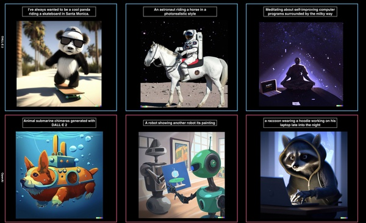

### 语言大模型

实现自然语言处理的语言模型有很多用途，如预测句子中的下一个单词或字符；总结一份文件；将文本内容从一种语言翻译成另一种语言；语音识别或将一段文本转换为语音，等等。对于 transformers ，不论是谁，都关注它在 NLP 中的应用。Transformer 是 21 世纪的第一个 10 年中最伟大的发明之一。如果有足够的数据和计算，大模型的效果总是令人震惊和惊羡的。在过去的 5 年里，语言模型规模一直在不断地扩大。论文《attention is all you need》$$^{[6]}$$ 发表一年以后，一切都开始改变。2018年，OpenAI 发布了 GPT （Generative Pre-trained Transformer），这是当时最大的语言模型之一。一年后，OpenAI 又发布了 GPT-2，这是一个拥有 15 亿个参数的模型。又过了一年，他们发布了拥有 1750 亿个参数的 GPT-3，并且在 570GB 的文本上训练了 GPT-3。整个模型采用 1750 亿个参数，大小为 700GB。 GPT-3 到底有多大？LAMBDA实验室做了这样的估算$$^{[16]}$$ ，如果用当前市场价格最低的提供 GPU 的云服务来训练它，需要花费 366 年和 460 万美元。然而，GPT-n系列只是一个开始，还有其他大模型。它们的大小接近 GPT-3 或者更大。例如：NVIDIA Megatron-LM 有83亿个参数。最新的 DeepMind Gopher 有2800亿个参数。2022年4月12日，DeepMind 发布了另一个有着700亿个参数的语言模型。这个模型名为 Chinchilla，尽管它比 Gopher、GPT-3 和 Megattron-turing NLG（5300亿个参数）更小，但它的性能超过了许多语言模型。Chinchilla 的论文表明：现有的语言模型训练不足，若将模型的大小翻倍，数据也应该翻倍。与之相当的，谷歌PaLM（Pathways Language Model）几乎在同一时间，它包括 5400 亿个参数。

​    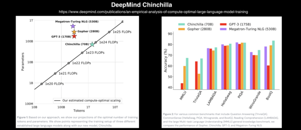 

Chinchilla 模型

这里要补充一个应该引起中文语言处理的模型：文心大模型，这是百度推出了。

### 代码生成模型

代码生成模型，即可以编程的人工智能系统，它可以编写特定的一段代码、或者根据自然语言或文本的要求生成函数。你可能会猜到，现代的代码生成器都是基于 Transformer 的。很久以来，就如同我们希望计算机能做其他事情一样，也在研究如何让计算机能自己编写程序。这方面的工作首先因为 OpenAI 发布了 Codex 之后得备受关注。Codex 是基于 GitHub 公开代码库和其他源代码训练过的GPT-3。OpenAI 表示：“OpenAI Codex 是一个通用编程模型，它基本上可以用于任何编程任务（尽管结果可能会有所不同）。我们已经成功地将它用于翻译、解释和重构代码。但我们知道，我们所能做的只是冰山一角。” Codex 现在支持 GitHub Copilot ，这是一款 AI 结对编程工具。

OpenAI 发布 Codex 几个月后，DeepMind 发布了 AlphaCode ，这是一种基于 transformer 的语言模型，可以解决竞争性编程比赛中的问题。AlphaCode 发布的博客称，“在编程比赛中，AlphaCode 通过解决需要批判性思维、逻辑、算法、编码和自然语言理解相结合的新问题，在参与者中获得了大约前 54% 的排名。” 解决编程问题非常困难。正如 Dzmitry 所说，超越人类水平还有若干光年之遥。不久前，Meta AI 的科学家发布了 InCoder，这是一种可以生成和编辑程序的生成模型。

### 回到感知机

在卷积神经网络和 transformer 兴起之前的很长一段时间里，深度学习都是围绕感知机发展的。后来，卷积神经网络在各种识别任务中表现出了优异的性能，取代了多层感知器。从 Vision Transformers 目前的状况来看，仍然是是很有前途的框架。但是感知器彻底消亡了吗？可能不会。就在 2021年7月，两篇基于感知器的论文得以发表，一篇是《MLP-Mixer: An all-MLP Architecture for Vision》$$^{[17]}$$ ，另一个是《Pay Attention to MLPs(gMLP)》$$^{[18]}$$ 。MLP-Mixer 声称，卷积和 attention 都是非必要的，它仅使用 MLP，就能够在图像分类上取得了很高的精度。MLP-mixer 的一个重要特征是它包含两个主要的 MLP 层：一个层独立应用于图像数据，称为通道混合；另一个层则是用于各个图像，称为空间混合。gMLP 还表明，抛弃了 self-attention 和卷积后，依然可以在图像识别和NLP任务中取得很高的准确度。   

​    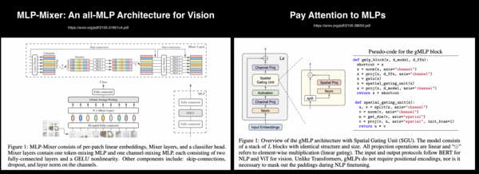 

MLP-Mizers和g-MLP

显然，你没有将 MLPs 应用到极致，令人着迷的是它们的确与最先进的深度网络可一决高下。

### 再谈卷积神经网络：面向21世纪20年代的卷积神经网络

自 2020 年以来，计算机视觉的研究一直围绕 transformers 展开。在 NLP 中，transformer 也已经成为一种规范。ViT 在图像分类方面表现优异，但在目标检测和图像分割则令人失望。随着 Swin Transformers 问世，没过多久，这些难关也被攻克。很多人都喜欢卷积神经网络，它真的很有效，我们很难放弃它们。怀着这种挚爱，一些科学家不断推动卷积神经网络的发展，进而提出了残差神经网络（ResNet）。Saining Xie和他在 Meta AI 的同事们正在致力于这项研究，他们在论文阐述研究成果，并最终得到了一个名为 ConvNeXt 的卷积网络框架。根据不同的测试标准，ConvNeXt 都取得了与Swin Transformer 相当的结果。关于 ConvNeXt 的详细内容，可以阅读参考资料 [19] 。

## 结论

深度学习是一个广阔天地，且日新月异，很难用较短的篇幅概括一切，此处仅仅是管中窥豹。这方面的论文浩如烟海，每个人只能了解很小的一个领域。在本文中，我们没有讨论的内容还很多，例如著名的 AlphaGo，深度学习框架、硬件加速器、图神经网络等等，还有很多很多。

## 参考资料

[1]. https://www.getrevue.co/profile/deeprevision/issues/a-revised-history-of-deep-learning-issue-1-1145664?continueFlag=0d4c136e098ffe282d51bc9870b62335

[2]. https://github.com/Nyandwi/ModernConvNets?utm_campaign=Deep Learning Revision&utm_medium=email&utm_source=Revue newsletter

[3]. https://www.deeplearningbook.org/contents/generative_models.html?utm_campaign=Deep Learning Revision&utm_medium=email&utm_source=Revue newsletter

[4]. https://www.zhihu.com/question/434784733

[5]. https://www.jiqizhixin.com/articles/2018-01-10-20

[6]. https://arxiv.org/pdf/1706.03762.pdf?utm_campaign=Deep Learning Revision&utm_medium=email&utm_source=Revue newsletter

[7]. https://arxiv.org/abs/2010.11929v2?utm_campaign=Deep Learning Revision&utm_medium=email&utm_source=Revue newsletter

[8]. https://arxiv.org/abs/1904.09925?utm_campaign=Deep Learning Revision&utm_medium=email&utm_source=Revue newsletter

[9]j. https://arxiv.org/abs/2006.03677?utm_campaign=Deep Learning Revision&utm_medium=email&utm_source=Revue newsletter

[10]. https://arxiv.org/pdf/2101.01169.pdf?utm_campaign=Deep Learning Revision&utm_medium=email&utm_source=Revue newsletter

[11]. https://arxiv.org/abs/2103.14899v2?utm_campaign=Deep Learning Revision&utm_medium=email&utm_source=Revue newsletter

[12]. https://arxiv.org/abs/2103.10697v2?utm_campaign=Deep Learning Revision&utm_medium=email&utm_source=Revue newsletter

[13]. https://arxiv.org/abs/2203.15380v2?utm_campaign=Deep Learning Revision&utm_medium=email&utm_source=Revue newsletter

[14]. https://arxiv.org/abs/2202.10936?utm_campaign=Deep Learning Revision&utm_medium=email&utm_source=Revue newsletter

[15]. https://arxiv.org/abs/1907.09358?utm_campaign=Deep Learning Revision&utm_medium=email&utm_source=Revue newsletter

[16]. https://lambdalabs.com/blog/demystifying-gpt-3/?utm_campaign=Deep Learning Revision&utm_medium=email&utm_source=Revue newsletter

[17]. https://arxiv.org/pdf/2105.01601v4.pdf?utm_campaign=Deep Learning Revision&utm_medium=email&utm_source=Revue newsletter

[18]. https://arxiv.org/pdf/2105.08050.pdf?utm_campaign=Deep Learning Revision&utm_medium=email&utm_source=Revue newsletter

[19]. https://github.com/Nyandwi/ModernConvNets/blob/main/convnets/13-convnext.ipynb?utm_campaign=Deep%20Learning%20Revision&utm_medium=email&utm_source=Revue%20newsletter