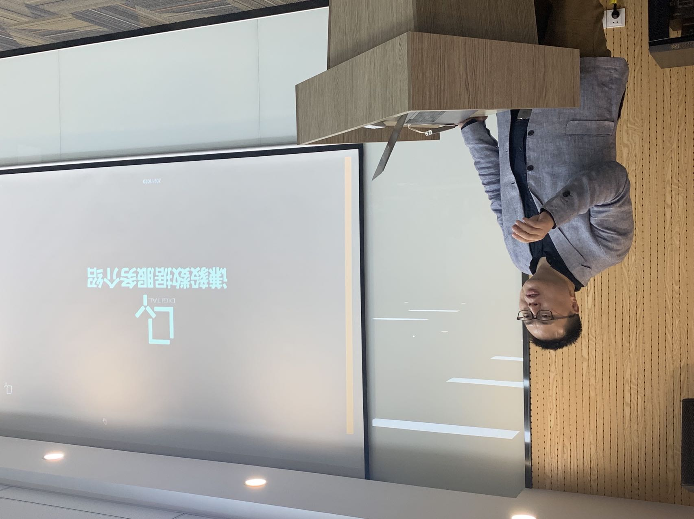
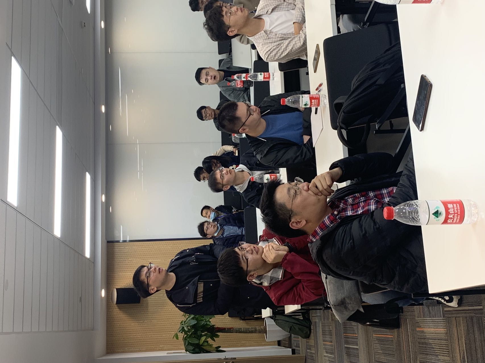
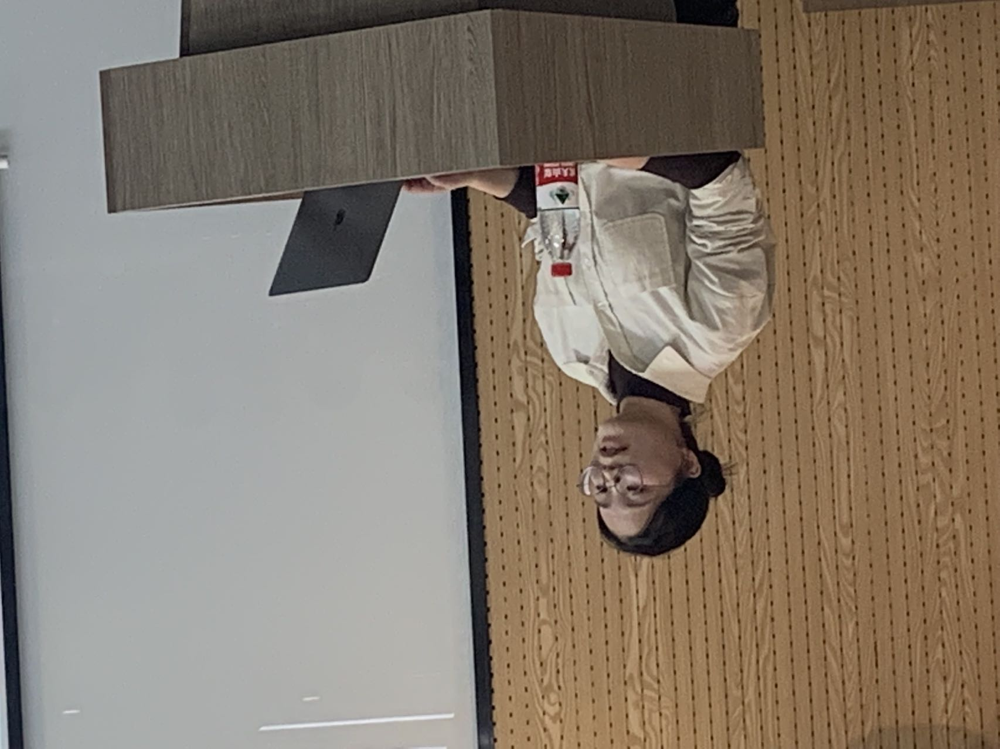
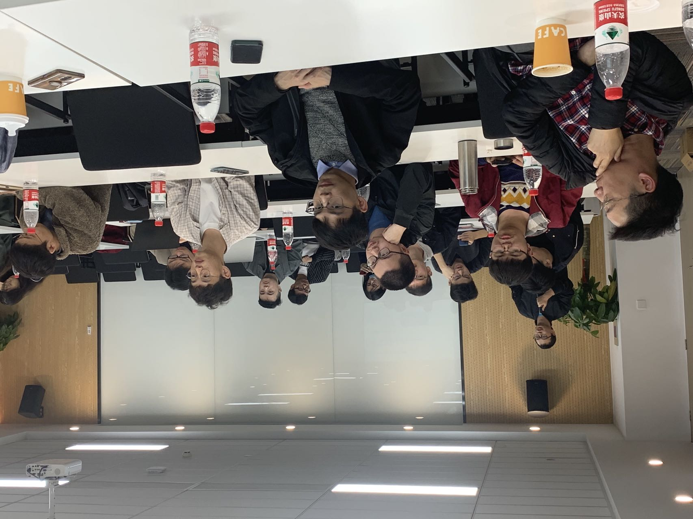

# 苏州大学应用统计专业开放课堂

苏州大学应用统计专业硕士教育旨在培养具有良好的统计学基础，并能从事数据分析、机器学习、深度学习等领域工作的专业开发者和研究者。特别是近几年进一步强化了面向企业实际需要的教学，提升了教学内容与开发实践的契合度，毕业生的研发能力得到了企业认可。

目前，随着人工智能技术在各个领域中广泛应用，企业对人才提出了更高要求。为进一步促进学校人才培养和企业的开发实践之间的衔接，苏州大学应用统计专业硕士研究生的教学将部分课程移至在独墅湖科教创新区青创港进行，设置以应用实践为主的开放课堂（简称"青创港开放课堂"）。

----

## 【一】商业智能系列：数据会说话

2021年11月7日下午2:00，开放课堂的第一次课准时开始。

唐老师首先从学科发展和教育改革的角度，介绍了“开放课堂”的意义，然后向同学们提出了学习要求。

然后齐老师介绍了课程的组成部分，以及每部分的内容和教学目的。

第一次课的主讲人，是来自苏州研途教育科技有限公司数据信息部的高级经理刘燕清先生。

在课程的第一阶段中，刘经理向同学们介绍了公司已经完成和正在进行的大数据项目。目前研途教育公司已经和正在利用大数据技术实现了用户行为分析、用户来源归因等，这些技术为公司业务的发展提供了坚实的技术支持。

通过第一阶段的课程，同学们了解到企业大数据项目的特点以及对企业进一步发展的作用。

第二阶段的课程中，刘经理以“大数据开发流程——数据会说话”为题，详细介绍了本部门的大数据开发流程。

刘经理在最后还向同学们推荐了学习大数据开发的技术路线。

听者受益匪浅。

在课程结束后的提问环节，同学们根据课程内容提出了一些非常有价值的问题，刘经理一一答复。并且还有旁听课程的企业界朋友，根据自身的工作经历，向同学们介绍了自己学习大数据技术感受。

最后，唐老师对本次开放课堂活动进行了总结，想同学们提出了进一步的学习要求，要求同学们多方位地向前来讲座的专业人士学习，从而能尽快提升自己的知识、技术等综合素质。

本次开放课堂由齐老师主持。

----

## 【二】商业智能系列：社交网络分析

2021年11月21日下午2：00，开放课堂第二次课在独墅湖科教创新区青创港准时开始，本次开放课堂由齐老师主持。

上海谦毅信息科技有限公司CTO杨秀峰先生和技术中心算法组经理马思柳女士受邀来到本次开放课堂，分别进行了企业项目介绍和专题技术讲座。

杨总从自己从事电商行业转变到广告行业的真实经历开始讲起，引出对上海谦毅信息科技有限公司的企业项目介绍，并指出公司技术中心的主要任务是对社交媒体的各类信息进行热点分析，以此来提高广告投放的精准性和有效性。

杨总首先讲到，广告投放的应用场景包括但不限于对行业进行趋势分析、针对用户画像精准投放、定向流量裂变以及对KOL达人的高效筛选等方面。其次从消费者角度来看，当消费者从传统消费路径转变为运用新媒体主动消费，企业需要依靠科技和数据，以专有工具来实现精准的广告投放。除此之外，从品牌的角度指出强化品牌态度的重要性，最后举出李雪琴与Columbia户外运动品牌合作的例子，加深用户对品牌的特征化印象。

通过杨总的介绍，同学们更加深刻地了解到数字营销企业的项目规划。在项目介绍后的提问环节，同学们就强化品牌态度、KOC营销手段以及销售渠道等方面广泛提问，杨总一一解答。

在社交网络分析的专题技术讲座中，马经理首先介绍了公司技术中心的主要业务内容——利用自然语言处理技术分析KOL/KOC特征和用户特征，并利用图神经网络分析社交网络中的用户关系，从而锁定关键节点用户。在更详细的讲解中，马经理指出获取数据后对数据进行标注是十分重要的，要注意标注数据的方法。

在讲座结束后的提问环节，同学们踊跃发言、积极互动，马经理耐心解答，并与同学们分享了自己学习自然语言处理的经历，鼓励同学们可以利用课余时间和网络资源加强相关知识的学习。

齐老师在开放课堂活动的最后对同学们的提问进行了详细的补充解答。

